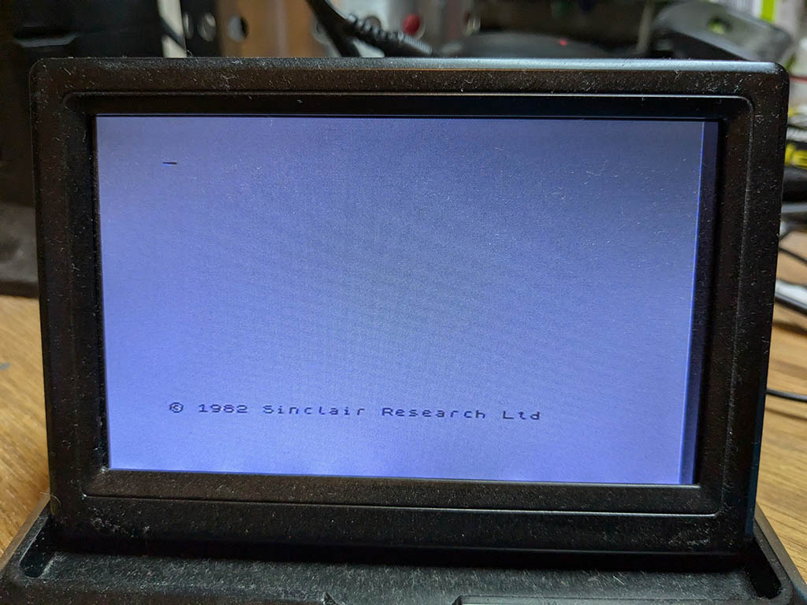
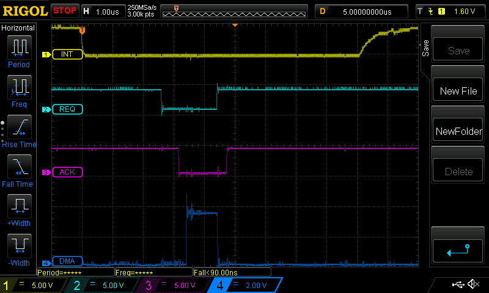
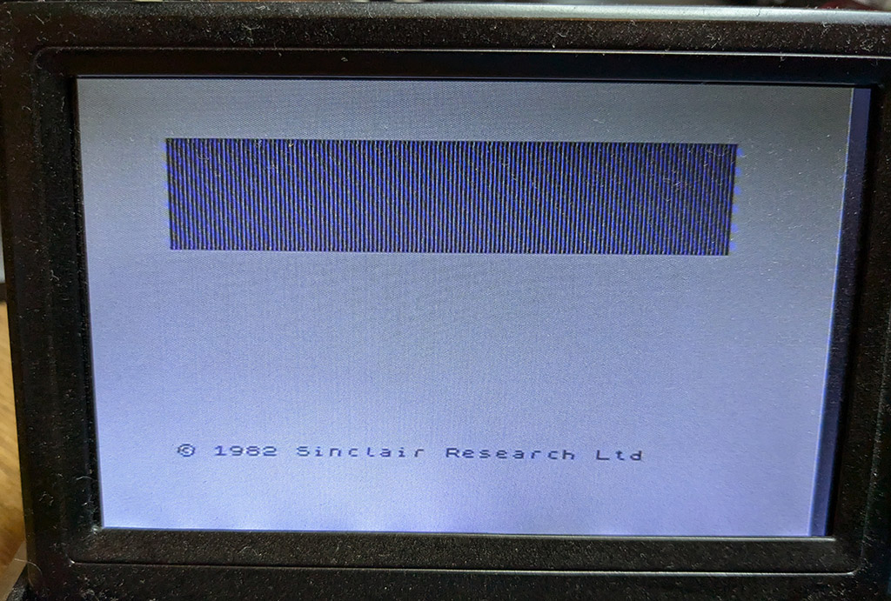
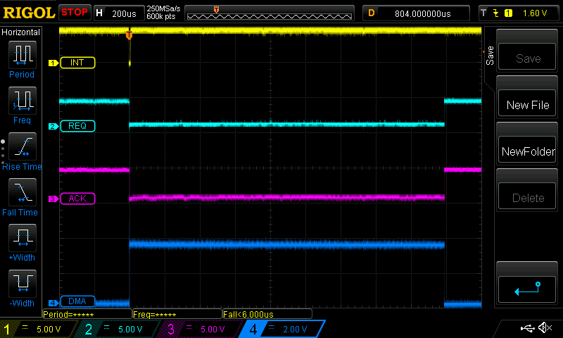
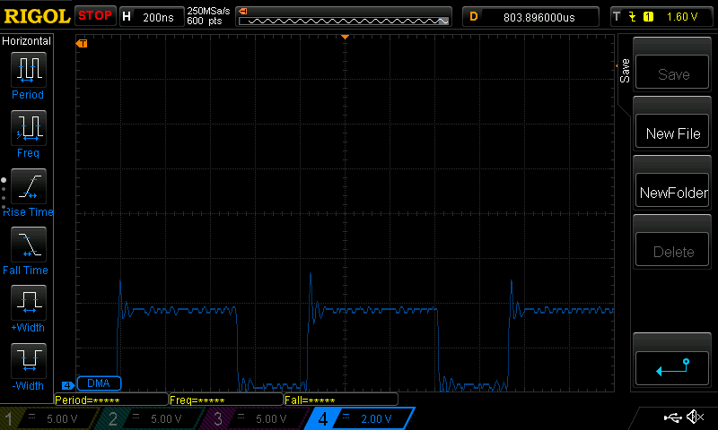

# zx-spectrum-pico-dma

The Z80 CPU inside the ZX Spectrum is capable of DMA transfers. i.e. an external
device can take control of the buses and directly read and write the Spectrum's
memory.

To the best of my knowledge, no interface from the Spectrum's commercial era ever
took advantage of this feature, probably because it's a rather fussy thing to
work with. I wondered if it was possible for a modern microcontroller like the
Raspberry Pi Pico to do it. Hence this project.

Spoiler: yes, it can.

## The Hardware

The hardware I used for this experimentation is my [ZX Diagnostics Board](https://github.com/derekfountain/zx-spectrum-diagnostics).
This board was designed to be flexible. It exposes on headers all the signals
from the Z80 (that are on the Spectrum's rear edge connector), which makes it
ideal for this sort of hardware hackery.

The main problem with doing retro-computing projects with the Pico is the limited
number of GPIOs: 26. To interface to an 8-bit micro you need to connect
GPIOs to 16 bits of address bus and 8 bits of data bus, which is 24, plus whatever
other control bus signals you need, plus user interface buttons and other things.
26 GPIOs isn't enough.

My diagnostics board interface has 2 Raspberry Pi Picos. One Pico is set up with
GPIOs connected to the data bus and several of the Z80 control bus signals, the
other Pico is set up with GPIOs connected to the 16 bits of address bus. A bit of
to and fro is required to keep them in sync, and it isn't ideal, but it does work.

I had to modify the diagnostics board slightly because when I designed it 
BUSREQ and BUSACK where not signals I connected to either Pico. So I soldered an extra
couple of wires:

* Pico 1 GPIO 16 connected to BUSREQ
* Pico 1 GPIO 17 connected to BUSACK

These Z80 signals were also wired to Pico 2 GPIO 26 and 28 respectively.

The other signals required here are IORQ, MREQ, RD and WR. These were already
connected up to Pico 1.

## The Contention Problem

One of the primary reasons this approach has rarely, if ever, been seen on a
Spectrum interface is the contention problem. The Spectrum's display is
generated by the ULA based on data it finds in the lower 16K of RAM. In order
to do that the ULA needs to be able to read that data from the 4116 DRAM
chips. But those chips are single ported, which means if the ULA and Z80 try
to read and/or write them simultaneously contention will happen, the ULA 
will get delayed or corrupted data, and the screen display will glitch.

The solution to this in the Spectrum circuitry is to have the ULA stop the
Z80's clock while the ULA is reading the screen memory. This solution would
also be required of any circuit which uses DMA to read or write the screen
memory. That is, if an external device takes control of the buses in order
to read of write to the screen memory, that device needs to stay clear of
the ULA's screen memory accesses otherwise contention becomes a problem.

## Timings

To do a DMA transfer into screen memory (0x4000 to 0x5AFF inclusive) it needs
to be timed precisely with the Spectrum's ULA hardware. The Spectrum hardware
in this area is simple and limited. The ULA emits a signal named INT
(because it's connected to the Z80's interrupt line) every 20ms. It does so when
the hardware is about to start drawing the screen and the TV raster is at the
top left corner.

So yes, that's simple, but it's also limited, because that's the only timing
signal the Spectrum emits. I have to work with that.

## Challenge 1 - Get it working

The initial challenge, then, is to get DMA working on the Spectrum. The aim here
is to write a single byte of data into the top left corner of the screen, with
everything else remaining stable and glitch free.

I'm going to put a dotted line - value 0x55 - in location 0x4000, so 4 little
dots appear in the corner.

## Approach

The approach used for this experimentation is as follows:

* Pico1 will raise a bus request, then wait for the Z80 to yield the buses and
respond with bus acknowledge
* Pico1 will tell Pico2 - which controls the address bus - to put the address
0x4000 on the address bus
* Pico1 will put the value 0x55 on the data bus
* Pico1 will drive the signal lines in sequence to force a memory write
* When the byte is written, Pico1 will tell Pico2 to stop driving the address
bus, and will itself stop driving the data and control bus lines
* Pico1 will then release the bus request signal and the Z80 can go back to
doing whatever it was doing

The key point is with the timing: this is going to happen while the ULA is
drawing the top border. Contention doesn't happen when the ULA is in 
"border time", only when the ULA is drawing the data part of the screen.
So if the DMA work can be done during border time there's no need to worry
about contention.

The other question is how long the buses need to be driven for. The first version
of my software controlled the signals with the same timing the Z80 uses. It
watched the CLK signal and responded to rising and falling clocks exactly as the
Z80 does (according to the timing diagrams in the Z80 manual). But that's not
necessary. Signals on the buses and control lines (like /MREQ and /WR) get to the
4116 DRAM chips via the Spectrum's ULA and multiplexers which pass the signals
in small numbers of nanoseconds. The 4116s themselves are the slow points, being
rated at completing a read or write in 150ns. It turns out that adding a delay
of 19 RP2040 "NOP" instructions between the /WR signal going active and inactive
is the minium requirement for successful writes. On a 125MHz RP2040 19 of the
single-cycle "NOP" instructions complete in 152ns, which seems to add up.

## Result

There's no point is trying to do this on an emulator, so screenshots are photos
from a real Spectrum screen.

Here's the result of the single byte write:

It's fuzzy and blurry, but, take my word for it, it does show what it should:
that splat in the in the top left corner is actually 4 individual dots. It sits
there permanently. Tapping ENTER clears the screen, but the dots flicker and
reappear immediately. They're being replaced every 20ms.

There's no way to stop this from the Z80 end. The BUSREQ/BUSACK mechanism on
the Z80 is highest priority, higher than NMI, even. If I do something on the
Spectrum which disables interrupts, the dots appear there anyway. The BEEP
command still plays a note, but it's a bit "buzzy."

## Signals Analysis

Here's the trace from the oscilloscope:

Yellow is the ULA's INT signal, which is pulled low every 20ms. The RP2040 on the
Pico is programmed with a hardware interrupt when that line goes low. The handler
function asserts the BUSREQ "bus request" signal, which is the light blue line.
BUSREQ goes low approximately 2.5 microseconds after INT goes low, that being the
time it takes for the RP2040 to respond to a GPIO interrupt.

The RP2040 code spins looking for BUSACK "bus acknowledge" to go low. There is a
variable length pause while the Z80 finishes the instruction it's running, and then
it pulls BUSACK low. That's the purple line. In the shown example, BUSACK goes low
about 600ns after BUSREQ went low, but this varies. The purple line flickers on
the 'scope.

When the BUSACK goes low the DMA process takes place. The dark blue line shows a high
pulse while the DMA is running. It takes just about 1uS to drive a transfer of one
byte to the Spectrum's memory. This includes the wasteful but necessary synchronisation
with the other Pico which drives the address bus.

As soon as the DMA is complete (blue line falling) the BUSREQ line is released
(light blue line rising). The Z80 retakes control (purple line rising as it turns
off the BUSACK signal) and the process is complete. End of DMA to the Z80 having
control again is about 150ns.

The Z80 "loses" the period of the purple line being low, which is about 1.6uS.

## Challenge 2 - More data

Proving a single byte can be written into Spectrum memory is gratifying, but not really
very useful. Next step is to try writing more data. Let's try 2KB. This requires
advancing the value on the address bus with each byte written. Here's the screen,
again a bit fuzzy, but correctly showing what it should:

That pattern is permanent, and since it takes a lot longer to transfer in than the
single byte example, the BEEP is a lot buzzier. Some games, presumably those that
don't read back their screen data, still work. Jetpac, for example, still runs quite
happily even though you can't see what you're doing.

The trace from the oscilloscope:

This all looks OK, but a problem is starting to appear. It takes the ULA 224 Z80 T-states
to draw a single line of the screen, and the top border is 64 lines high. So  Spectrum "top
border time" is 64 line times, which is 14,336 T states. A T is 1/3,500,000 of a second so
top border time is 0.004096 of a second, or a smidge over 4ms. The oscilloscope trace shows
the DMA time for 2048 bytes (dark blue line) to be just about 1,800uS, or 1.8ms. That's to
DMA one third of a Spectrum screen. A full screen will take 5.4ms, not including the time
taken to transfer the attributes data which is another 768 bytes (32x24 bytes).

I put a trace pulse in the code which drives the address bus:
 

This line goes high at the point the required address is loaded onto the Z80's address
bus, then goes low again when the address bus is relinquished. It takes about 500ns,
so that's the time for writing one byte. On top of that, there's quite a bit of overhead as
the Picos signal and synchronise with each other, all of which could be removed if I can use a
single microcontroller with enough GPIOs to do everything itself. But I don't have one
of those, and there's no way to avoid the synchronisation at the moment.

This is disappointing. DMA can only really be done in border time, to avoid contention. (I
saw plenty of contention while I was experimenting with this. The screen glitches all over
the place.) I was hoping to be able to do full screen scrolling in the RP2040, for example,
but clearly if the screen can't be quickly transferred back into the Spectrum after processing
then it's not much use.

I figured it might be possible to interweave the DMA with the CPU's CLK signal. The CLK is
generated by the ULA, so when the CLK signal goes flat that means the ULA is accessing
RAM. But that means somehow accessing the CLK such that when it stops pulsing the RP2040
stops the DMA. It might be possible to do that? Perhaps a PIO watching the CLK signal
and indicating to the core when the CLK stops? I didn't try it but it might work.

TBC